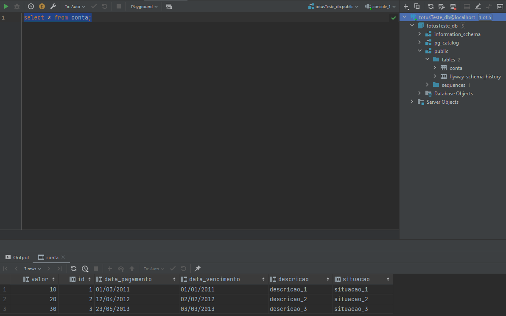
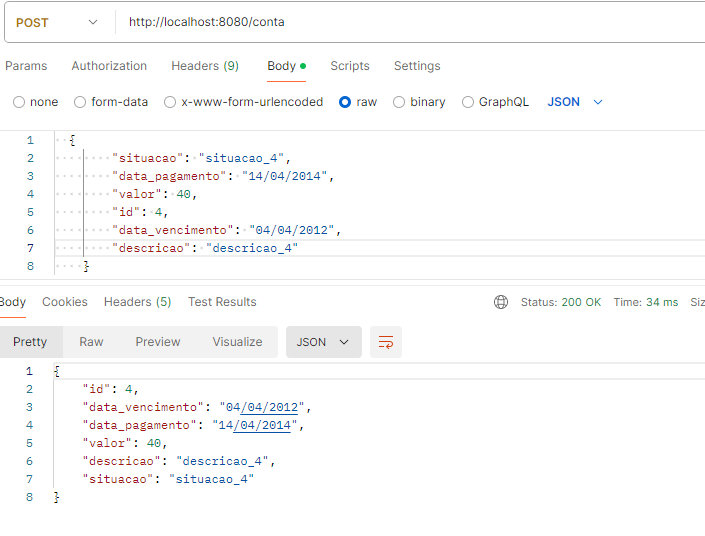
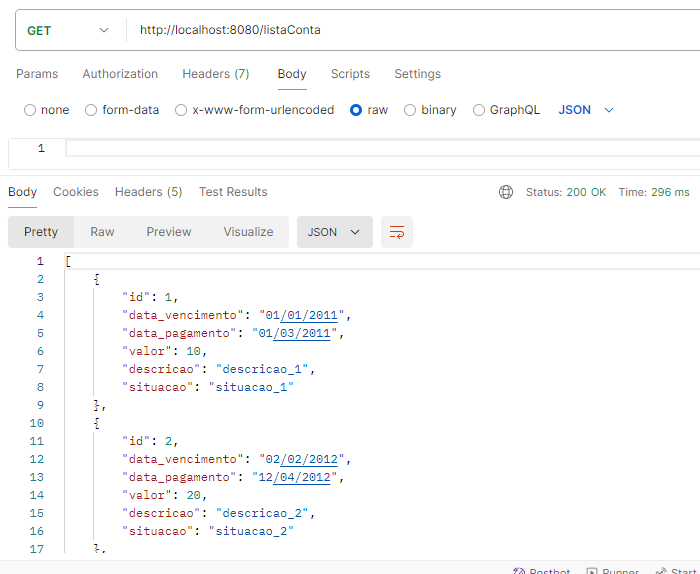
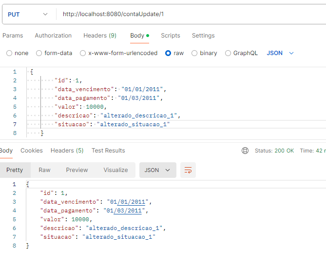
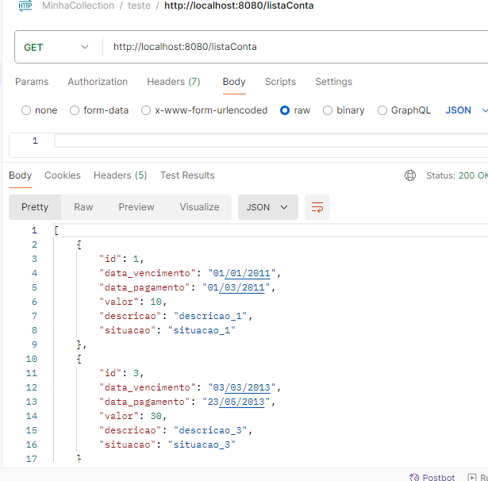

# Teste para Totus

Esse teste foi solicitado pela empresa Totus, o teste é para desenvolver um API simples e extração de dados de arquivo CSV e enviar os dados do arquivo via API para o banco de dados PostgreSQL.

## Arquivo CSV

No projeto contém um arquivo CSV ( arquivoCSVTotusTeste.csv ) para ser usado no teste de extração dos dados e viando via API.

## Conteudo do arquivo CSV

O arquivo contém 6 colunas.

- id (Tipo long)
- data_vencimento (Tipo String)
- data_pagamento (Tipo String)
- valor (Tipo inteiro)
- descricao (Tipo String)
- situacao (Tipo String)

## OBSERVAÇÃO

Quando for enviar os dados para o banco, NÃO É ENVIADO O ID DO ARQUIVO CSV PARA O BANCO DE DADOS.

## Localização do arquivo CSV

O arquivo está na pasta /test/resources/arquivo/

## Requisitos para executar

- Java 17 
- PostgreSQL
- PostMan
- Spring Boot
- JPA
- Junit
- Flywaydb

## Como executar o projeto

- Executa a classe TotusTesteApplication.java

## Evidências dos Testes

## Evidência do banco de dados

# Evidência Postman

* ## Post
- URL http://localhost:8080/conta

* ## Get
- URL http://localhost:8080/listaConta

* ## Put
- URL http://localhost:8080/contaUpdate/

* ## Delete
- URL http://localhost:8080/deleteConta/

- ### Foi excluido as informações do ID 2
